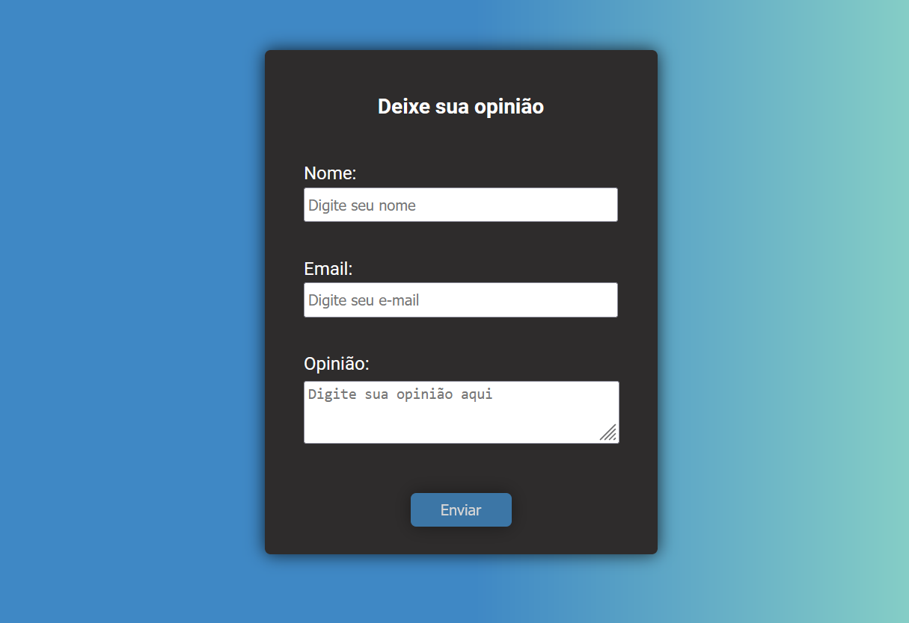

# **Formulário React**

## **Sobre o projeto**

Formulário desenvolvido através do React hook form com a validação feita com yup. Os dados obtidos no formulário são enviados via axios para uma fake api construída com jso-server.

## **Instalando Dependências**

### Atenção, neste momento é muito importante realizar todas instalações necessárias para a execução do projeto!

1. Abra o terminal **DENTRO** da pasta que você acabou de **CLONAR**, é nela que vamos instalar todas seguintes requisições:

### OBS: Copie uma linha de cada vez e pressione enter.

- **npm i**
- **npm install axios**
- **npm install react-hook-form**
- **npm install -S yup**
- **npm install -g json-server**

## ✅**Inicializando o Projeto**
 
1. **npm start**
2. npm run backend - (para inicializar o json server);

## **API utilizada:**

- Utilizamos a API <a href="https://www.npmjs.com/package/json-server" target="blank">Json-server</a> para simular o envio das informações do formulário para uma api.

## **React Hooks Usados:**

- useForm
- useState

